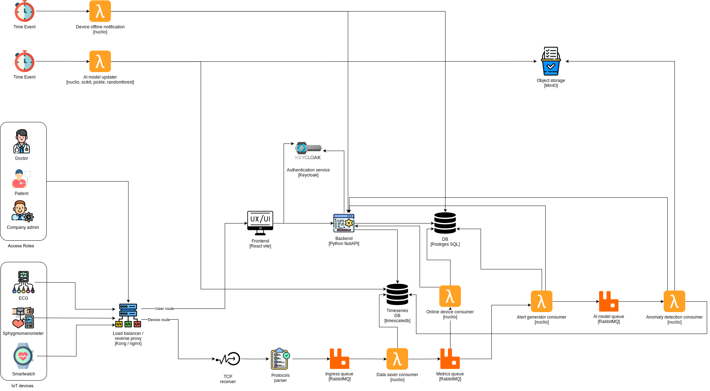

# [System Design] IoT Ingest process and visualize

# Healthcare Monitoring System



## 🏥 Overview

The Healthcare Monitoring System is a comprehensive IoT-based solution designed to enable healthcare providers to monitor patients remotely. The system supports both in-facility patient monitoring and remote patient care scenarios, providing real-time health data collection and analysis through medical-grade smart devices.

### Key Features

- 🔄 Real-time patient vital signs monitoring
- 🏥 Multi-patient monitoring capabilities for healthcare providers
- 📱 Support for both in-facility and remote patient scenarios
- 🔐 Secure authentication and authorization via Keycloak
- 📊 Advanced data analytics and anomaly detection
- 🚨 Real-time alerts and notifications
- 📈 Time-series data storage and analysis
- 🖥️ Web-based dashboard for healthcare providers and patients

## 🏗️ System Architecture

The system is built using a modern microservices architecture with the following key components:

### Frontend Layer
- React-based web interface for healthcare providers and patients
- Responsive design supporting multiple device types
- Real-time data visualization

### Backend Services
- FastAPI-based Python backend
- Kong API Gateway for routing and security
- Keycloak for identity and access management
- RabbitMQ for message queuing
- Nuclio for serverless function processing
- TimescaleDB for time-series data storage
- PostgreSQL for application data

### IoT Integration
- Support for medical-grade IoT devices (e.g., Huawei Watch D)
- Real-time data collection and processing
- Protocol parsing and data transformation
- Anomaly detection using AI/ML models

## 🚀 Getting Started

### Prerequisites

- Docker and Docker Compose
- Git
- Node.js (for frontend development)
- Python 3.8+ (for backend development)

### Installation

1. Clone the repository:
```bash
git clone .
cd healthcare-monitoring-system
```

2. Start the services using Docker Compose:
```bash
docker compose up -d
```

### Default Service Ports

| Service | Port | Description |
|---------|------|-------------|
| Kong API Gateway | 8000, 8443 | API Gateway (HTTP/HTTPS) |
| Kong Admin API | 8001, 8444 | Admin API (HTTP/HTTPS) |
| Konga Dashboard | 1337 | Kong Admin UI |
| Keycloak | 8180 | Identity Server |
| Prometheus | 9090 | Metrics Collection |
| Grafana | 3000 | Monitoring Dashboard |
| RabbitMQ | 5672, 15672 | Message Broker & Management |
| Nuclio | 8070 | Serverless Platform |
| TimescaleDB | 5430 | Time-series Database |
| PostgreSQL | 35432 | Application Database |
| pgAdmin | 8888 | Database Management |

## 🔒 Security

The system implements multiple security layers:

- OAuth2/OpenID Connect via Keycloak
- API Gateway security policies
- Role-based access control (RBAC)
- Encrypted data transmission
- Secure data storage

## 🎯 Use Cases

### Healthcare Providers
- Monitor multiple patients in real-time
- Receive alerts for abnormal vital signs
- Access patient historical data
- Manage patient profiles and care plans

### Patients
- View personal health data
- Access historical measurements
- Receive notifications and reminders
- Communicate with healthcare providers

## 🔧 Configuration

### Environment Variables

Key environment variables are defined in the Docker Compose file. Additional configuration can be done through:

- Kong configuration
- Keycloak realm settings
- Prometheus and Grafana dashboards
- Database initialization scripts

## 📈 Monitoring

The system includes comprehensive monitoring:

- Prometheus metrics collection
- Grafana dashboards for visualization
- RabbitMQ queue monitoring
- API Gateway performance metrics

## 🛠️ Development

### Adding New Features

1. Fork the repository
2. Create a feature branch
3. Implement changes
4. Submit a pull request

### Code Style

- Follow PEP 8 for Python code
- Use ESLint for JavaScript/React code
- Implement comprehensive tests
- Document new features and APIs


